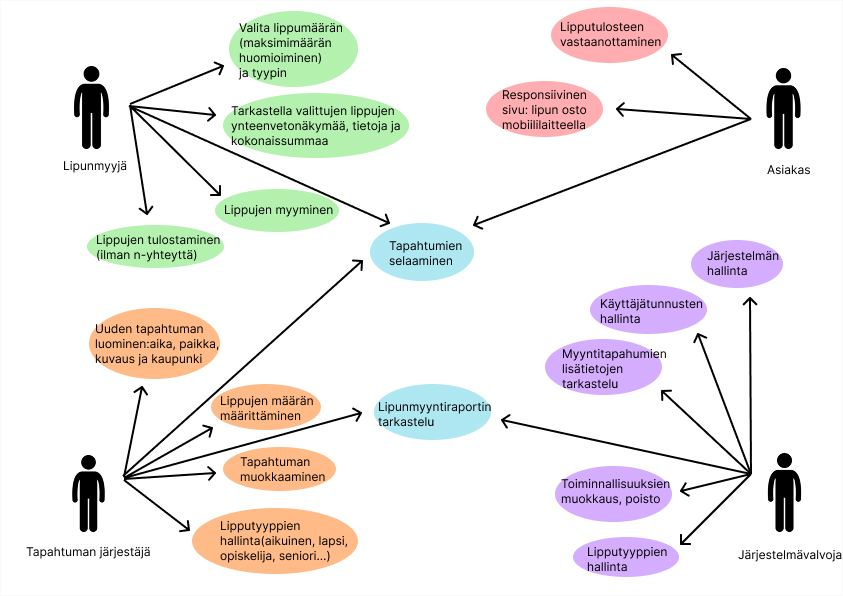
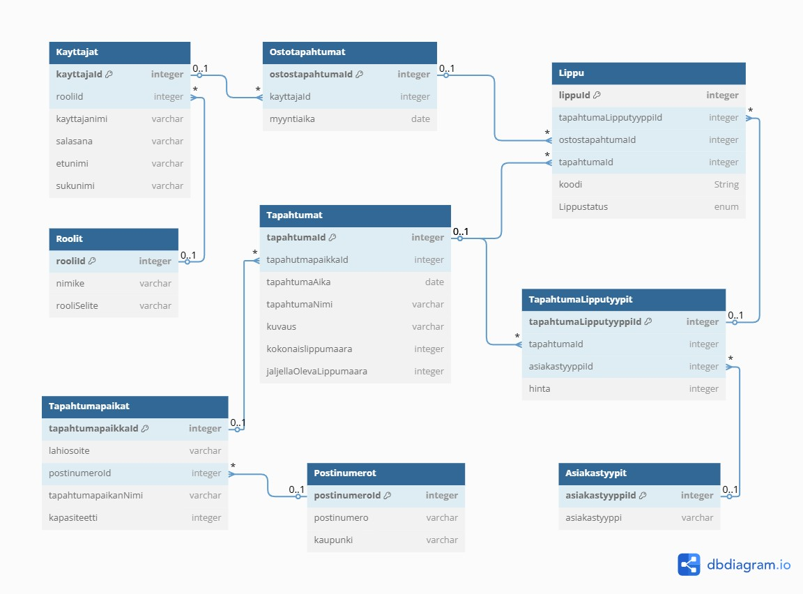

# TicketGuru

Tiimi: Liisa Davydov, Max Lindqvist, Mikko Vitikka, Ossi Lukkarinen, Marjo Ek

## Johdanto

Projektin tarkoituksena on tuottaa asiakkaan tilaama lipunmyyntijärjestelmä.
 Kyseistä järjestelmää hyödynnetään asiakkaan myyntipisteissä, joissa lipunmyyjä myy, tulostaa ja tarkistaa liput QR-koodilla.

Projekti toteutetaan hyödyntämällä Scrum-mentelmää, minkä avulla tiimi pystyy tuottamaan tasasin väliajoin uusia toiminnallisuuksia sovellukseen.
 Viikottaisten sprinttien avulla tiimi pystyy hyvin kartoittamaan työn etenemistä, ja tunnistamaan mahdolliset ongelmakohdat tuotteen kehittämisessä.

## Järjestelmän määrittely

### Järjestelmän keskeiset käyttäjät
-   Lipunmyyjä
-   Tapahtuman järjestäjä
-   Järjestelmävalvoja

### Järjestelmän perustoiminnot
-   Tapahtumien hallinta
-   Lippujen myynti ja tulostus
-   Myyntiraporttien tarkastelu



## Käyttöliittymä

### Lipunmyynti

Sivu jolla myyjä pystyy myymään asiakkaalle lippuja ja tulostamaan asiakkaalle liput heti maksun jälkeen. Myyntiin asetetuille lipuilla tulisi lähtökohtaisesti olla perustiedot tallennettuna järjestelmässä.

- Päivämäärä, kellonaika
- Tapahtuman nimi
- Hintaluokat (Aikuiset, lapset . . .)
- Myyntien summa


### Tapahtumien hallinta

Sivu jolla nähdään aikaisemmin luodut tapahtumat. Jokaiselle hallinta toiminnallisuudet (Uuden luonti, muokkaus).

Toiminnallisuudet
- Tapahtumien listaus -> uuden tapahtuman lisäys -> tapahtuman muokkaus -> siirtyminen tapahtumakohtaiseen Myyntiraporttiin
- Lipputyyppien hallinnointi (Ikäluokat, alennukset . . .)

### Myyntiraportti

Sivu jolla nähdään tapahtumien kaikki myyntitapahtumat listattuna.

Tapahtumakohtainen raportti jossa näkyy heti alkuun:
- Myydyt liput lipputyyppien mukaan ("Aikuiset", Kpl: . . ., Yhteensä: . . .)
- Totaalinen tuotto lipuista
- Tapahtumakohtainen Myyntiraportti -> Myyntitapahatumat -> Ostostapahtuma

## Tietokanta



> ### _Käyttäjät_
> 
>
> Kenttä | Tyyppi | Kuvaus
> ------ | ------ | ------
> käyttäjä_id | int PK | Käyttäjän id
> rooli_id | int FK | Rooli, viittaus [Roolit](#Roolit)-tauluun
> käyttäjänimi | varchar(50) |  Käyttäjän nimi
> salasana | varchar(50) | Salasana
> etunimi | varchar(30) | Etunimi
> sukunimi | varchar(50) | Sukunimi


> ### _Roolit_
> 
>
> Kenttä | Tyyppi | Kuvaus
> ------ | ------ | ------
> rooli_id | int PK | Roolin id
> nimike | varchar(50) |  Roolin nimi
> rooli_selite | varchar(100) | Roolin kuvaus


> ### _Tapahtumat_
> 
>
> Kenttä | Tyyppi | Kuvaus
> ------ | ------ | ------
> tapahtuma_id | int PK | Tapahtuman id
> tapahtumapaikka_id | int FK |  Tapahtumapaikka, viittaus [Tapahtumapaikat](#Tapahtumapaikat)-tauluun
> tapahtuma_aika | Date | Tapahtuman päivämäärä ja kellonaika
> tapahtuma_nimi | varchar(50) | Tapahtuman nimi
> kuvaus | varchar(500) | Lyhyt kuvaus tapahtuman sisällöstä
> kokonaislippumaara | int | Tapahtumaan asetettu lippujen kokonaismäärä. Oltava pienempi kuin tapahtumapaikan maksimikapasiteetti.
> jaljella_oleva_lippumaara | int | Jäljellä olevien lippujen määrä

> ### _Tapahtumapaikat_
> 
>
> Kenttä | Tyyppi | Kuvaus
> ------ | ------ | ------
> tapahtumapaikka_id | int PK | Tapahtumapaikan id
> lahiosoite | varchar(100) |  Tapahtumapaikan lähiosoite
> postinumero | varchar(50) FK |  Postinumero, viittaus [Postinumerot](#Postinumerot)-tauluun
> tapahtumapaikan_nimi | varchar (50) | Tapahtumapaikan nimi
> kapasiteetti | int | Tapahtumapaikan maksimikapasiteetti

> ### _Postinumerot_
>
>
> Kenttä | Tyyppi | Kuvaus
> ------ | ------ | ------
> postinumero | varchar(50) PK | Postinumero
> kaupunki | varchar(50) | Kaupunki, johon postinumero sijoittuu.

> ### _Ostostapahtumat_
> 
>
> Kenttä | Tyyppi | Kuvaus
> ------ | ------ | ------
> ostostapahtuma_id | int PK | Ostotapahtuman id
> myyntiaika | Date | Ostotapahtuman aika
> kayttaja_id | int FK | Käyttäjä, viittaus [Käyttäjät](#Käyttäjät)-tauluun

> ### _Tapahtuma_Lipputyypit_
> 
>
> Kenttä | Tyyppi | Kuvaus
> ------ | ------ | ------
> tapahtuma_lipputyyppi_id | int PK | Tapahtuma lipputyypin id
> tapahtuma_id | int PK |  Tapahtuma, viittaus [Tapahtumat](#Tapahtumat)-tauluun
> asiakastyyppi | varchar(30) | Asiakastyyppi, viittaus [Asiakastyypit](#Asiakastyypit)-tauluun
> hinta | DECIMAL(10,2) | hinta

> ### _Liput_
> 
>
> Kenttä | Tyyppi | Kuvaus
> ------ | ------ | ------
> lippu_id | int PK | Lipun id
> ostostapahtuma_id | int fk |  Ostostapahtuma, viittaus [Ostostapahtumat](#Ostostapahtumat)-tauluun
> tunniste | varchar(20) | Lipuntarkastus tunniste
> tapahtuma_lipputyyppi_id | int FK | Tapahtuma Lipputyyppi, viittaus [Tapahtuma Lipputyyppit](#Tapahtuma_Lipputyypit)-tauluun
> tapahtuma_id | int fk | Tapahtuma, viittaus [Tapahtumat](#Tapahtumat)-tauluun
> status | varchar | Lipun status, joko MYYTY tai KÄYTETTY

> ### _Asiakastyypit_
> 
>
> Kenttä | Tyyppi | Kuvaus
> ------ | ------ | ------
> asiakastyyppi_id | int PK | Asiakastyypin id
> asiakastyyppi | varchar(20) |  Asikastyypin selite


## API-dokumentaatio
Kaikki endpointit on kuvattu erillisessä dokumentaatiossa:
- [API-dokumentaatio](API-dokumentaatio/README.md)

## Tekninen kuvaus

### Käytettävät teknologiat
- Frontend: React + Vite
- Backend: Spring Boot, JWT-autentikointi
- Tietokanat: PostreSQL
- Deployment: CSC Rahti(OpenShift pohjainen)
- Päälaitteet: Tietokone, tabletti, älypuhelin

## Palvelintoteutus ja deployment
- Sovellus buildataan Dockerin tai source-imagen avulla
- Rahtissa käytetään Deployment YAML -tiedostoja, jotka määrittävät podit, service-tasot ja salaisuudet
- PostgreSQL käynnistetään siemendatan kanssa

## Turvallisuusratkaisut
- JWT-pohjainen autentikointi, joka tarkistetaan kaikissa suojatuissa API-kutsuissa refresh-tokenin avulla
- Tokenin vanhentuminen ja uusimislogiikka käytössä
- Yhteydet HTTPS:n kautta, salaus pakotetaan frontendin ja backendin välillä
- Tietokantayhteys suljettu ulkomaailmalta, pääsy vain backend-palvelulta
- Syötteen validointi


## Testaus

Projektin testauksessa hyödynnettiin kolmen tason testejä:

- Yksikkötestaus (Junit): Testasimme backendin logiikkaa yksittäisten metodien ja palvelukomponenttien tasolla varmistaaksemme niiden oikean toiminnan.

- Integraatiotestaus (Junit + Spring Boot): Testasimme eri komponenttien (esim. controllerit, palvelut ja tietokantakerros) yhteistoimintaa käyttämällä Spring Bootin tarjoamia testityökaluja.

- End-to-End -testaus (Cypress): Testasimme frontendin käyttöliittymän ja backendin toiminnan yhteispeliä simuloimalla käyttäjän toimintoja selainympäristössä.

Testejä ajettiin kehityksen eri vaiheissa ja niitä päivitettiin uusien ominaisuuksien myötä. Testien avulla varmistettiin järjestelmän toimivuus ja regressioiden ehkäisy ennen tuotantoon vientiä.

## Asennustiedot

Järjestelmän käyttöä varten suositellaan seuraavia työkaluja asennusta:

- Visual Studio Code tai muu koodieditori
- Java 17 (tai muu yhteensopiva versio)
- Node.js ja npm
- PostgreSQL-tietokanta
- Git

Projektin kloonaaminen GitHubista
- Asenna Git koneellesi: https://git-scm.com/downloads
- Avaa komentorivi ja siirry haluamaasi kansioon.
- Kloonaa projektin repository komennolla:
  
  ``
git clone <repository-url>
  ``
- Siirry projektikansioon ja avaa se koodieditorissa

## Käynnistys- ja käyttöohje

Backendin käynnistäminen
1. Avaa backend-projekti (esim. TicketGuruApplication) Visual Studio Codessa tai muussa IDE:ssä.
2. Varmista, että PostgreSQL-tietokanta on käynnissä.
3. Mavenin asennus
4. Käynnistä Spring Boot -sovellus.

Frontendin käynnistäminen
1. Siirry frontendin kansioon
2. Käynnistä frontend-sovellus: npm start

Tietokannan konfigurointi
1. Asenna PostgreSQL tietokannan hallintaa varten
2. Luo uusi tietokanta, joka vastaa tietokannan kaaviota
3. Tietokannan konfigurointi Spring Bootissa:
Avaa application.properties tai application.yml -tiedosto projektin src/main/resources -hakemistosta. Täytä tietokannan yhteysasetukset:
```
spring.datasource.url=jdbc:postgresql://localhost:5432/ticketguru
spring.datasource.username=your_username
spring.datasource.password=your_password
spring.jpa.hibernate.ddl-auto=update
```
